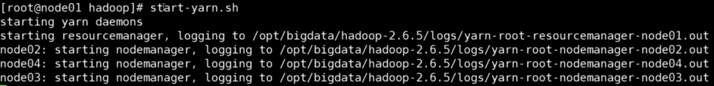

##  Cluster Manager Types
```
Standalone – a simple cluster manager included with Spark that makes it easy to set up a cluster.
Apache Mesos – a general cluster manager that can also run Hadoop MapReduce and service applications.
Hadoop YARN – the resource manager in Hadoop 2.
Kubernetes – an open-source system for automating deployment, scaling, and management of containerized applications.
```

# spark all on  yarn部署配置

<h1 id="yarn">yarn</h1>

## cd $HADOOP_HOME/etc/hadoop/

## vi  yarn-site.xml

最后一行添加下面配置

```
<property>
	<name>yarn.nodemanager.aux-services</name>
	<value>mapreduce_shuffle</value>
</property>
<property>
  <name>yarn.resourcemanager.ha.enabled</name>
  <value>true</value>
</property>
<property>
  <name>yarn.resourcemanager.zk-address</name>
  <value>node02:2181,node03:2181,node04:2181</value>
</property>
<property>
  <name>yarn.resourcemanager.cluster-id</name>
  <value>mashibing</value>
</property>
<property>
  <name>yarn.resourcemanager.ha.rm-ids</name>
  <value>rm1,rm2</value>
</property>
<property>
  <name>yarn.resourcemanager.hostname.rm1</name>
  <value>node03</value>
</property>
<property>
  <name>yarn.resourcemanager.hostname.rm2</name>
  <value>node04</value>
</property>
 <property>
  <name>yarn.log-aggregation-enable</name>
  <value>true</value>
</property>
 <property>
  <name>yarn.log-aggregation.retain-seconds</name>
  <value>604800</value>
</property>

<property>
	<name>yarn.nodemanager.resource.memory-mb</name>
	<value>4096</value>
</property>
<property>
	<name>yarn.nodemanager.resource.cpu-vcores</name>
	<value>4</value>
</property>
<property>
	<name>yarn.nodemanager.vmem-check-enabled</name>
	<value>false</value>
</property>
```
后面三个配置，可以根据每台机器的性能进行调节，核心数调高，内存调高


## vi  mapred-site.xml 

:node03# mr-jobhistory-daemon.sh start historyserver

```
<property>
	<name>mapreduce.framework.name</name>
	<value>yarn</value>
</property>

<property>
	<name>mapred.job.history.server.embedded</name>
	<value>true</value>
</property>
<property>
	<name>mapreduce.jobhistory.address</name>
	<value>node03:10020</value>
</property>
<property>
	<name>mapreduce.jobhistory.webapp.address</name>
	<value>node03:50060</value>
</property>
<property>
	<name>mapreduce.jobhistory.intermediate-done-dir</name>
	<value>/work/mr_history_tmp</value>
</property>
<property>
	<name>mapreduce.jobhistory.done-dir</name>
	<value>/work/mr-history_done</value>
</property>
```

### 操作完之后同步另外三台服务器

scp yarn-site.xml mapred-site.xml node02:`pwd`

scp yarn-site.xml mapred-site.xml node03:`pwd`

scp yarn-site.xml mapred-site.xml node04:`pwd`

### `启动yarn`：

cd $HADOOP_HOME/etc/hadoop/   **start-yarn.sh**

RM只配置了03-04两台，这里01启动会不成功，只会启动nodeManager



node03~04: /opt/bigdata/hadoop-2.6.5/sbin
			**yarn-daemon.sh start resourcemanager**

网页访问：**node03:8088**


历史作业查看：node03

mr - jobhistory-daemon.sh start historyserver

​    **./sbin/start-history-server.sh**

e)访问 启动有  history-server主机的主机名 默认端口是  http://node03:8088/

### 集群配置图

|                 | Node01 | Node02 | Node03 | Node04 |
| --------------- | ------ | ------ | ------ | ------ |
| Namenode        | 1      | 1      |        |        |
| Journalnode     | 1      | 1      | 1      |        |
| Datanode        |        | 1      | 1      | 1      |
| Zkfc            | 1      | 1      |        |        |
| zookeeper       |        | 1      | 1      | 1      |
| resourcemanager |        |        | 1      | 1      |
| nodemanager     |        | 1      | 1      | 1      |
| Hiveserver2     |        |        | 1      |        |
| beeline         |        |        |        | 1      |

1.  基础设施：

    jdk：1.8.xxx
    
    节点的配置
    
    部署hadoop：hdfs  zookeeper
    
    免密必须做
    
2.  wget spark.tar

    tar xf spark.tar.gz
    
    mv sparkhome /opt/bigdata/


# hadoop  standalone

## 视屏053

## 部署细节：

vi /etc/profile

export SPARK_HOME=/opt/bigdata/spark-2.3.4-bin-hadoop2.6

$SPARK_HOME/conf

slaves
```
node02
node03
node04
```
spark-env.sh
```
# 每台master改成自己的主机名
export HADOOP_CONF_DIR=/opt/bigdata/hadoop-2.6.5/etc/hadoop
export SPARK_MASTER_HOST=node01
export SPARK_MASTER_PORT=7077
export SPARK_MASTER_WEBUI_PORT=8080
export SPARK_WORKER_CORES=4
export SPARK_WORKER_MEMORY=4g
```

spark-config.sh

export JAVA_HOME=/usr/java/jdk1.8.0_371

先启动 zookeeper

在启动 hdfs


最后启动 spark  （资源管理层）  master  workers

进入spark的sbin目录之后再用，不然会和hadoop的命令混淆

./start-all.sh	这个是启动当前的master以及其他的worker

./start-master.sh	如果是双主，需要自己再手动启动命令

双主启动之后，会去zookeeper里面抢锁

​	zkCli.sh

​		get /msbspark/master_status   会显示master的IP

跑程序

​	bin目录下，不是sbin

​	./spark-shell --master spark://node01:7077,node02:7077


spark-defaults.conf
```
spark.deploy.recoveryMode       ZOOKEEPER
spark.deploy.zookeeper.url      node02:2181,node03:2181,node04:2181
spark.deploy.zookeeper.dir      /msbspark

spark.eventLog.enabled true
spark.eventLog.dir hdfs://mycluster/spark_log
spark.history.fs.logDirectory  hdfs://mycluster/spark_log
```

hdfs dfs -mkdir -p /spark_log

vi  spark-config.sh

export JAVA_HOME=/usr/java/jdk1.8.0_371

```
scp spark-config.sh node02:`pwd`   03~04
```


a)修改配置一定要分发、重启服务

```shell
scp -r ./spark-2.3.4-bin-hadoop2.6  node02:`pwd`
scp -r ./spark-2.3.4-bin-hadoop2.6  node03:`pwd`
scp -r ./spark-2.3.4-bin-hadoop2.6  node04:`pwd`
```

vi /etc/profile

**export SPARK_HOME=/opt/bigdata/spark-2.3.4-bin-hadoop2.6**

. /etc/profile

echo $SPARK_HOME

b)计算层会自己将自己的计算日志存入hdfs

### 历史任务--history程序

c)手动启动：**./sbin/start-history-server.sh**

e)访问 启动有  history-server主机的主机名 默认端口是  **18080**

###   提交程序： spark-submit
```
./bin/spark-submit \
  --class <main-class> \
  --master <master-url> \
  --deploy-mode <deploy-mode> \
  --conf <key>=<value> \
  ... # other options
  <application-jar> \
  [application-arguments]
```
  ```
      ../../bin/spark-submit  \
      --master spark://node01:7077,node02:7077   --class org.apache.spark.examples.SparkPi  ./spark
    -examples_2.11-2.3.4.jar    100000
  
  ```

企业里面一般会写一个所谓的脚本，下面这种sh文件

  vi submit.sh

加上这个之后，就是客户端提交任务创建Executor之后，可以退出，任务还是继续在服务端跑

  ```
    class=$1
    jar=$2
    $SPARK_HOME/bin/spark-submit   \
    --master spark://node01:7077,node02:7077 \
  
    --class $class  \
    $jar \
    1000
  ```
不取系统环境变量用单引号 ' '，取系统环境变量用双引号 " "

  ```
  .  submit.sh   'org.apache.spark.examples.SparkPi'  "$SPARK_HOME/examples/jars/spark-examples_2.11-2.3.4.jar"
  ```

### 任务提交-调度

**spark-submit** --help   可以在这里面多学学参数

  --deploy-mode cluster  \

--deploy-mode  
--driver-memory  1024m  driver 
    #有能力拉取计算结果回自己的jvm
    #driver、executor jvm中会存储中间计算过程的数据的元数据

--driver-cores  # cluster  mode

**这三个是工作中调的最多的参数**
--total-executor-cores  #standalone  yarn  每 executor 1  core
--executor-cores 1
--executor-memory  1024m

--driver-memory MEM
--executor-memory MEM

--executor-cores NUM
--num-executors NUM

[Submitting Applications - Spark 2.3.4 Documentation (apache.org)](https://spark.apache.org/docs/2.3.4/submitting-applications.html)


##  YARN资源调度-视频054

Spark On Yarn！

Kylin -> 麒麟

### 部署

1.  退掉 spark的  master 、worker
2.  **spark on yarn ：不需要 master，worker的配置,rm -fr slaves**
3.  只需要启动yarn的角色

####    搭建配置：

**spark-env.sh**

这个文件下**其他全注释掉**，只保留下面这一个

```
export HADOOP_CONF_DIR=/opt/bigdata/hadoop-2.6.5/etc/hadoop
```
另外一个slaves文件，可以直接rm -rf 了，rm -fr slaves

**spark-defaults.conf**

前面这三个做master高可用的，也**可以注释掉了**

```
#spark.deploy.recoveryMode       ZOOKEEPER
#spark.deploy.zookeeper.url      node02:2181,node03:2181,node04:2181
#spark.deploy.zookeeper.dir      /msbspark
  
spark.eventLog.enabled true
spark.eventLog.dir hdfs://mycluster/spark_log
spark.history.fs.logDirectory  hdfs://mycluster/spark_log
spark.yarn.jars  hdfs://mycluster/work/spark_lib/jars/*
```

新加了最后一条，yarn的jar目录，后序不用本地上传，因为包太大的话，本地会耗时很长时间

### 准备开始操作

改三个文件的配置，改完之后分发到另外三台服务器

1、注释掉slaves里面的配置

2、注释掉spark-defaults.conf里面前三个，后面加一个yarn的上传hdfs包路径

3、spark-env.sh这个里面全注释掉，只保留hadoop的环境变量

scp slaves spark-defaults.conf spark-env.sh node04:`pwd`

然后进入hadoop，改yarn的xml配置

跳转<a href="#yarn">yarn</a>配置

### 启动慢-需要添加下面的jar目录

**vi  spark-defaults.conf**

**spark.yarn.jars  hdfs://mycluster/work/spark_lib/jars/***

hdfs dfs -mkdir -p /work/spark_lib/jars

cd $SPARK_HOME/jars

hdfs dfs -put ./*  /work/spark_lib/jars

hdfs dfs -ls -h /user/root/.sparkStaging/

### `spark启动` on yarn的client交互模式，只在当前的客户端里

spark-shell只支持client模式

cd $SPARK_HOME/bin

**./spark-shell --master yarn** 		启动了之后访问yarn的资源页面  http://node03:8088/

​		会在node01-04启动一个SparkSubmint、ExecutorLauncher、
​		CoarseGrainedExecutorBackend、CoarseGrainedExecutorBackend的java程序

hdfs dfs -ls -h /user/root/.sparkStaging/		可以查看当前任务的提交程序目录


client:ExecutorLauncher  
cluster:ApplicationMaster
**spark-shell  只支持  client模式**
spark-submit  跑非交互的-repl 的可以是client、cluster

### `spark启动` cluster模式

```sh
#--total-executor-cores 6 \
#--executor-cores 4 \
class=org.apache.spark.examples.SparkPi

jar=$SPARK_HOME/examples/jars/spark-examples_2.11-2.3.4.jar
#master=spark://node01:7077,node02:7077
master=yarn


$SPARK_HOME/bin/spark-submit   \
--master $master \
--deploy-mode cluster \
--class $class  \
$jar \
100000
```

--deploy-mode cluster 

​	会在node02-03上启动ApplicationMaster、CoarseGrainedExecutorBackend两个程序


